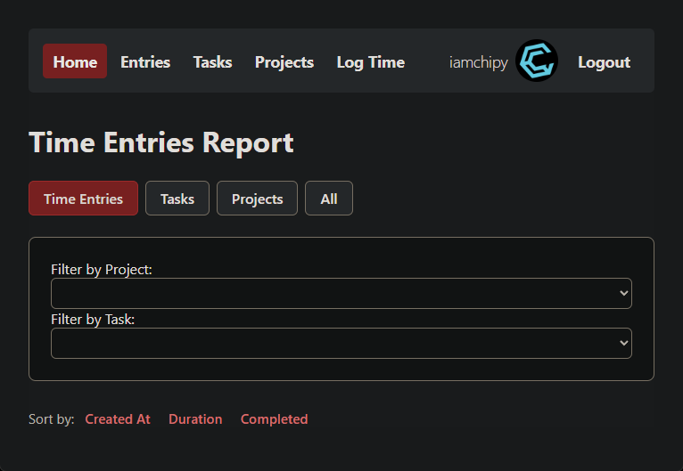

# Teakeypr – Time Tracking 

Teakeypr is a web-based time tracking application designed specifically for my freelance time-tracking. Built with Ruby on Rails, it attempts to efficiently log hours, manage tasks, and track project progress, all within a user-friendly interface.



### Example of it hosted at https://www.tk.johndavidbasson.com
---

## Features

- **User Authentication**: Secure sign-up and login via email or OAuth providers like Google and Discord.
- **Project Management**: Create and manage projects, assign tasks, and set deadlines.
- **Time Logging**: Log hours spent on tasks with optional comments.
- **Task Tracking**: View task statuses and progress at a glance.
- **Responsive Design**: Optimized for both desktop and mobile devices.

---

## Technologies Used

- **Backend**: Ruby on Rails
- **Frontend**: HTML, CSS (TailwindCSS), JavaScript
- **Authentication**: Devise gem with OmniAuth for OAuth
- **Database**: PostgreSQL
- **Deployment**: AWS's EC2 and RDS (obviously any can work)

---

## Installation

To set up Teakeypr locally:

1. **Clone the repository**:

```bash
git clone https://github.com/yourusername/teakeypr.git
cd teakeypr
```

2. **Install dependencies**:

```bash
bundle install
```

3. **Create master.key and save credentials**:

```bash
VISUAL="code --wait" bin/rails credentials:edit
# The editor should open up (above line is for editing in VSCode)
# Make sure you fulfil the ENV variables for your DB config 
# we currently user PostgrSQL adapter
```
Here is an example of my structure
```ruby
production:
  database: teakeypr----
  username: ----
  password: ----
  host: ----
  port: 5432

oauth2:
  google_id: ----
  google_secret: ----
  discord_id: ----
  discord_secret: ----
```

4. **Set up the database**:

```bash
rails db:create
rails db:migrate
rails db:seed
```

5. **Start the Rails server**:

```bash
rails server
```

6. **Visit `http://localhost:3000` in your browser to access the application.**


## Usage

- **Sign Up / Log In**: Use your email or sign in with Google/Discord.
- **Create Projects**: Navigate to the 'Projects' section to add new projects.
- **Log Time**: Under each task, click 'Log Time' to record hours worked.
- **View Entries**: Check the 'Entries' tab to see all your logged hours.

---

## Contributing

We welcome contributions to Teakeypr! To get started:

1. Fork the repository.
2. Create a new branch (`git checkout -b feature-name`).
3. Make your changes and commit them (`git commit -am 'Add new feature'`).
4. Push to your forked repository (`git push origin feature-name`).
5. Open a pull request detailing your changes.

---

## License

This project is licensed under the MIT License – see the [LICENSE](LICENSE) file for details.